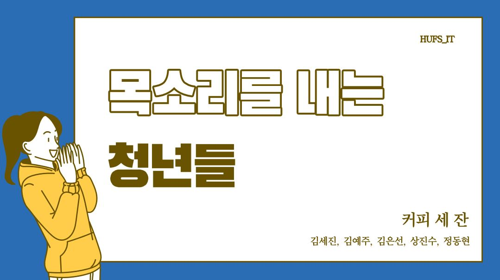

# 목 청

## **커피 세 잔**
**팀 구성**
   * 팀장 : 김세진
   * 팀원 : 김예주, 김은선, 상진수, 정동현
   

[발표자료 : 목소리를-내는-청년들_목청__커피-세-잔](docs/목소리를-내는-청년들_목청__커피-세-잔.pdf)
## **목소리를 내는 청년들**
2030을 위한 **블록체인** 기반 **여론조사** 플랫폼

## **1. 기획 배경**
1. 여론조사에 대한 신뢰도 하락**
   * 직접적인 여론 조작
   * 편향된 조사방식과 응답자
   * 낮은 응답률

2. **블록체인 기반**의 보안성, 신뢰성 보장
3. **접근성** 및 **다양성** 보장
4. 1430만명의 **2030 청년층 의견** 중요성 제고
 

## **2. 프로세스**

 

## **3. 특징 및 차별점**
1. **신뢰성, 안전성**
   * **블록체인 기반**으로 하여 2030 응답자는 
   * **안전하게 참여** 의뢰자는 **신뢰도 높은 결과**를 확인

2. **확실한 타겟층**
   * 서베이 수요자 : 2030 청년층의 목소리를 듣고 싶은 **정부기관 및 국내외 기업들**
   * 서베이 응답자 : 의견을 표출하기 어려워하는 **2030 청년들** 약 1430만명
   * 3rd Party : **소상공인**(보상형 상품 제공자)

3. **'쉬운' 서비스**
   * **접근하기 쉬운** : 목청 웹과 앱 채널 활성화
   * **보기 쉬운** : 분야별 카테고리를 배치
   * **참여하기 쉬운** : 한번의 클릭으로 참여가능, 코인 사용법 다양화

4. **상생효과**
    * **2030청년 & 기관, 기업 간**의 상생
    * **이용자 & 소상공인**들과의 상생
 

## **4. 기대효과**

 

## **5. Demo 영상**
 